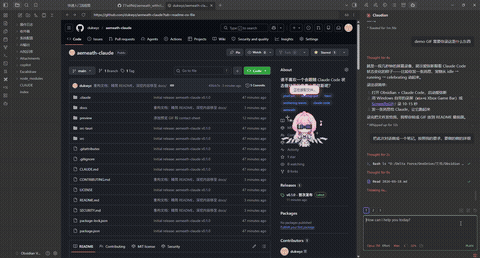
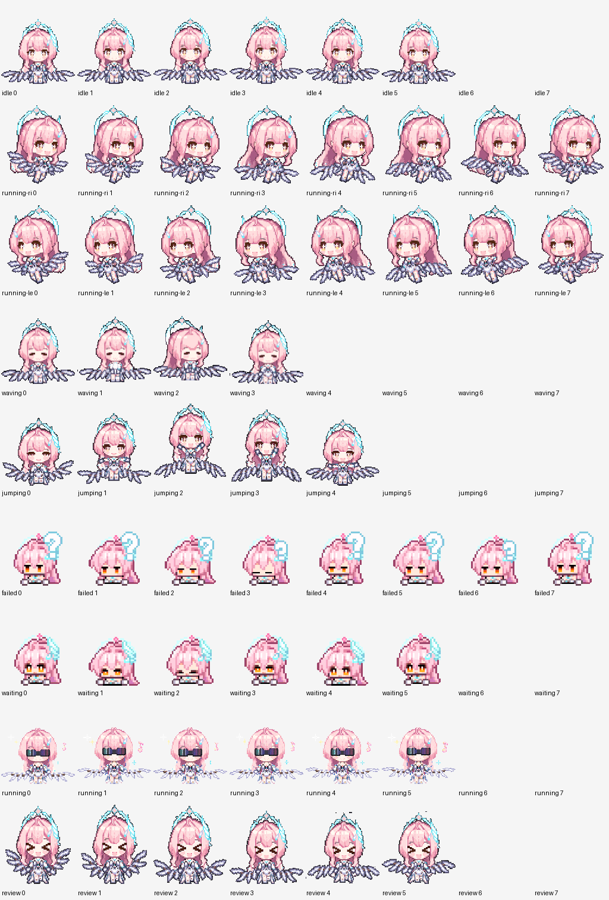

# 🐱 Aemeath Claude Code Pet

> 谁不喜欢一个会跟随 Claude Code 状态做动画的像素小爱弥斯呢？


Q 版像素爱弥斯（Aemeath）桌面宠物，与 Claude Code 实时联动。基于 [aemeath_withclaude](https://github.com/77wilNd/aemeath_withclaude) 改造，新增持久化气泡、游戏自动隐身、idle 提醒等功能。



---

## 截图预览

| 待机 | 招手 | 执行任务 |
|------|------|----------|
|  |  |  |

| 跳跃 | 异常 | 完成 |
|------|------|------|
|  |  |  |

| 等待 | Q 版总览 |
|------|----------|
|  |  |

---

## 功能

- **15 种像素动画**：idle、running、chatting、fetching、searching、analyzing、building、celebrating 等
- **持久化气泡**：工具执行期间气泡持续显示，不会消失
- **权限渐进恢复**：等待权限时气泡持续显示，超时自动清除
- **Idle 提醒**：空闲 5+ 分钟后随机提醒你回来工作
- **双击打开 Obsidian**：双击爱弥斯直接打开 Obsidian
- **游戏自动隐身**：全屏游戏时自动隐藏，切回桌面自动显示
- **透明悬浮窗**：无边框、可拖拽、始终置顶
- **零 Token 消耗**：6 个核心 hook 全部 HTTP 类型，不污染对话上下文

---

## 快速安装

### 1. 下载

从 [Releases](https://github.com/dukwyz/aemeath-claude/releases/latest) 下载 `aemeath-claude.exe`，放到 `.claude/aemeath/` 目录。

### 2. 修复 WebView2Loader.dll

运行 exe 如果报错"找不到 WebView2Loader.dll"，从系统复制一份到 exe 同目录：

```bash
cp "/c/Program Files/Common Files/Adobe/Microsoft/EdgeWebView/WebView2Loader.dll" \
   ".claude/aemeath/"
```

### 3. 配置

将 `docs/hooks.json` 中的 JSON 合并到你的 `~/.claude/settings.json` 的 `hooks` 字段（记得替换路径）。

将 `docs/mcp.json` 中的内容添加到项目根目录的 `.mcp.json` 的 `mcpServers` 字段。

### 4. 完成

重启 Claude Code，爱弥斯自动出现在桌面上！

> 📖 **详细安装指南**：[docs/installation.md](docs/installation.md)

---

## 构建

```bash
# 安装 Rust（首次）
winget install Rustlang.Rustup

# 安装 Tauri CLI
cargo install tauri-cli --version "^2"

# 构建
npm install
cargo build --manifest-path src-tauri/Cargo.toml --release
```

产出：`src-tauri/target/release/aemeath-claude.exe`

---

## 更多文档

| 文档 | 内容 |
|------|------|
| [安装指南](docs/installation.md) | 完整安装步骤、hooks 配置、MCP 配置 |
| [功能详解](docs/features.md) | 15 种动画状态、持久化气泡、双击踩坑记录 |
| [排错指南](docs/troubleshooting.md) | 常见问题解决方案 |

---

## 来源与授权

- 基于 [77wilNd/aemeath_withclaude](https://github.com/77wilNd/aemeath_withclaude) 改造，MIT License
- 像素小人素材来源：[lzy-buaa-jdi/aemeath](https://github.com/lzy-buaa-jdi/aemeath)，MIT License
- Q 版精灵图素材：[cuNuo/aemeath-mini-codex-pet](https://github.com/cuNuo/aemeath-mini-codex-pet)，MIT License
- 爱弥斯、《鸣潮》及相关官方视觉设定归其权利方所有
- 本仓库仅包含整理后的桌宠代码、精灵图集，不含官方立绘原图

## License

MIT
